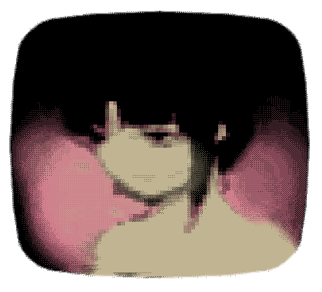

#  Overhaulded Task Switcher

A modern, fluid and highly visual replacement for the Windows Alt+Tab experience 🫩.

`Ofc, made as a practice of cpp. Hope you all enjoy this as me developing this.`

## Screenshot

# ![OverhauldedWin-Task-Switcher]https://raw.githubusercontent.com/IMiloDev/OverhauldedWin-Task-Switcher/main/assets/icons/TaskManager.png)

## Features

* Modern horizontal task switcher interface
* App grouping by application/process
* Real DWM window previews
* Dynamic Obsidian visual system
* CPU-based desktop blur
* Fluid Pop opening animation
* Smooth horizontal navigation
* Hover interactions and window closing
* Resolution-aware UI scaling
* Configurable animation FPS
* AltGr + Tab support
* Alt + Tab support
* Lightweight native C++ implementation

## Design

Overhaulded focuses on a dark, minimal interface inspired by modern desktop UI design while keeping the selector feeling native to Windows.

The visual system uses a Black Obsidian surface with subtle content-based illumination, rounded cards, restrained shadows and smooth transitions.

## Requirements

* Windows (11 Only)

## License

This project is licensed under the **MIT License**.

See the [LICENSE](LICENSE) file for the complete license text.

`Current ver: 1.0.0`
